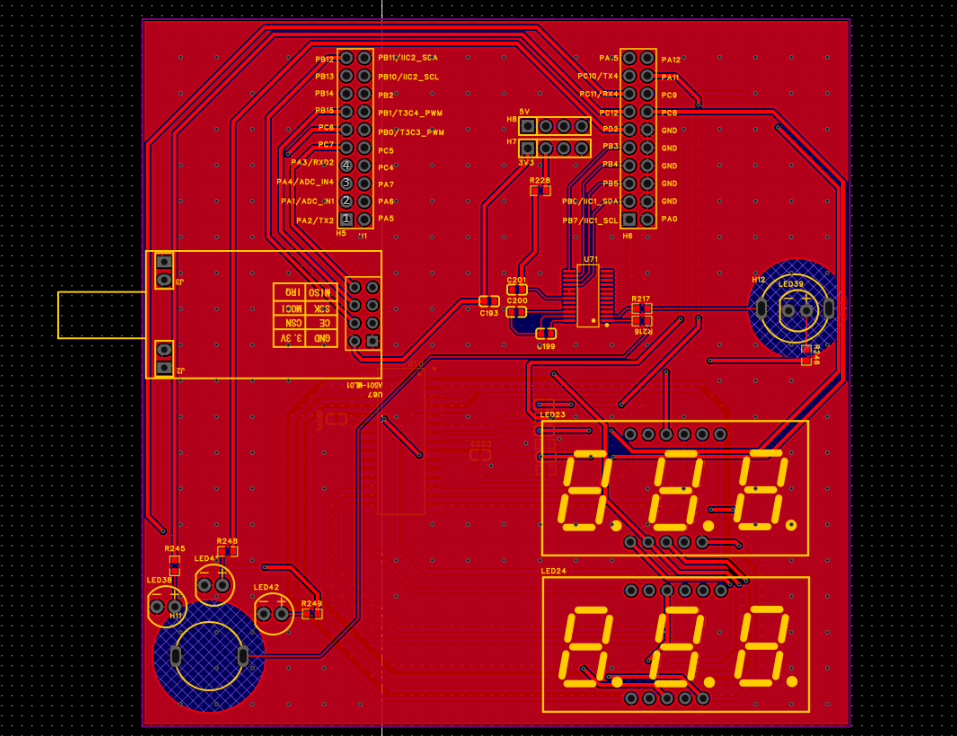
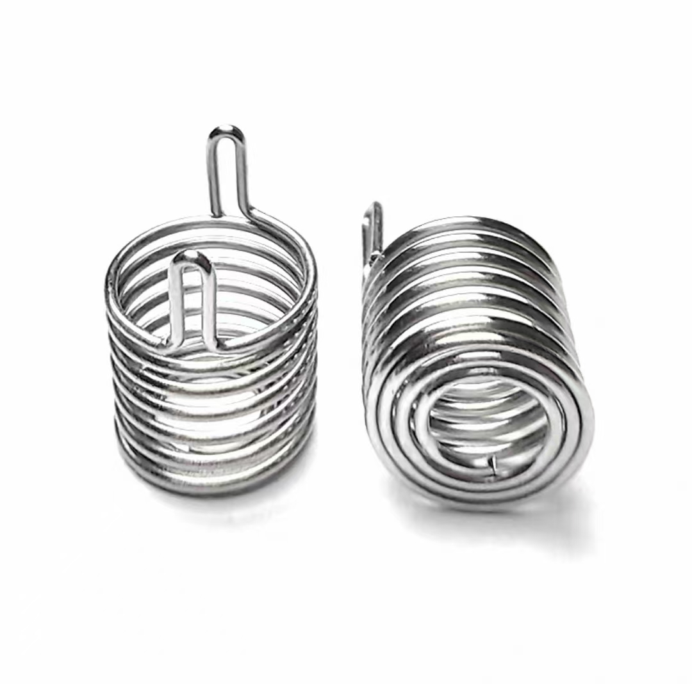
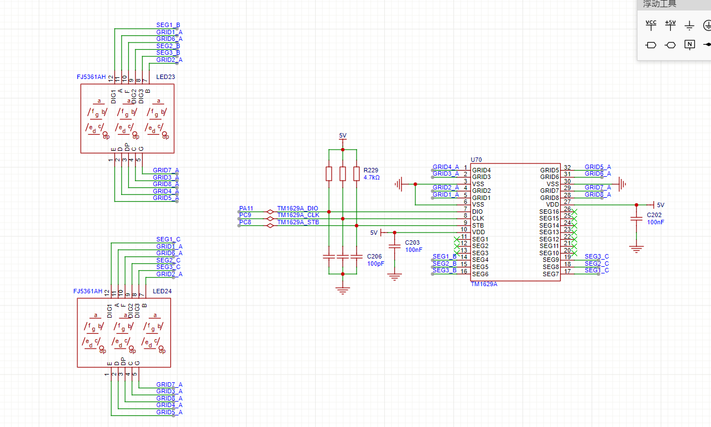

# <span class="green"><font size=3>一、工程介绍</font></span>

```bash
create_at：2025/08/04
aliases：验证AI12触摸芯片的功能，同时验证PCB布线与布局的可行性。
         验证TM1629A数码管驱动芯片的功能，本次只验证对共阳数码管的驱动函数的功能。
```

## <font size=2>1.功能板PCB布局设计说明</font>

<font size=2>为快速验证Demo,节省焊接成本，本次Demo板使用自制的STM32F103RET6最小单片机系统板，在功能板上绘制AI12和TM1629A的外围电路。</font>


## <font size=2>2.触摸芯片PCB布局说明</font>
<font size=2>触摸按键形式：弹簧触摸按键</font>

敷铜：本次的功能板使用双面板，上下均需要大规模敷铜，特别需要注意的是，触摸弹簧主体外围禁止敷铜，以外径为边界，禁止敷铜区域需间隔2.5mm以上。以TOP层作为弹簧安装面，TOP层需要设置禁止敷铜区域，底层不需要设置。
焊接：弹簧主体焊接时下方底部不能紧靠板面。
布线：线径设置0.2mm。


## <font size=2>3.TM1629A对于共阳数码管的接线说明</font>
<font size=2>TM1629A使用三线串行控制引脚来与MCU进行数据交互，进而控制数码管的数显。此外，它有SEG1 ~ SEG16一共16个段输出引脚，GRID1 ~ GRID8一共8个位输出引脚，也就是说，这个芯片是一个16段8位的数码管驱动芯片，理论上可以控制8个单数字共阴数码管进行数显。本次设计，增加显示控制的数码管个数到16个，显然使用DRIG1 ~ DRIG8这8个位输出引脚是不够用的。为此，SEG1 ~ SEG16作为公共端，接入共阳数码管的公共脚，将SEG1~SEG8最为段控制引脚接到数码管的a,b,c,d,e,f,g,dp这8个段脚上，这样可单个控制显示的数码管个数就可以增加到16个。本次设计使用两个3位共阳数码管进行测试，实际接线如图所示。</font>



